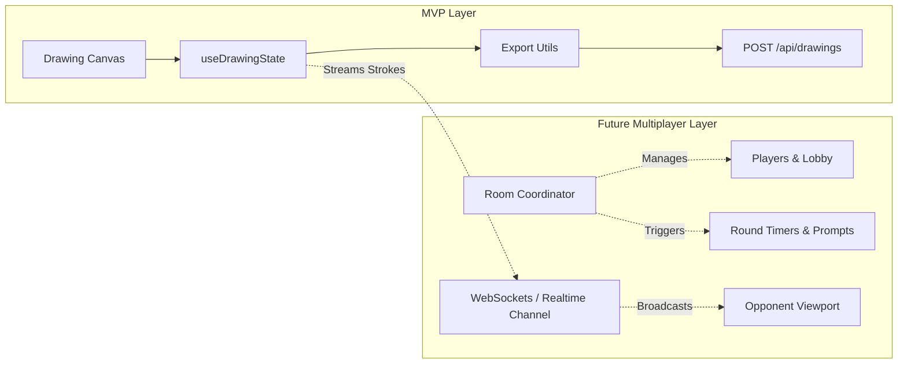

# Implementation Plan: Drawing Canvas MVP

**Branch**: `001-drawing-canvas-mvp` | **Date**: 2026-08-23 | **Spec**: [`spec.md`](file:///C:/Users/musa/Desktop/throatgoat/specs/001-drawing-canvas-mvp/spec.md)

**Input**: Feature specification from [`specs/001-drawing-canvas-mvp/spec.md`](file:///C:/Users/musa/Desktop/throatgoat/specs/001-drawing-canvas-mvp/spec.md)

---

## Summary

Build the first MVP of **Throat Goat**, a humorous social-media-inspired drawing web application. The initial product delivers a complete, responsive in-browser drawing experience with customizable tools (palette, brush size, eraser, multi-step undo, safeguarded clear), solid-background image export, zero-trust server validation, two-tier persistence (Supabase PostgreSQL for metadata and Supabase Storage for image assets via an abstracted storage provider), and a public gallery for retrieving community drawings. The system is cleanly decoupled to allow future multiplayer room and real-time game extensions.

---

## Technical Context

**Language/Version**: TypeScript 5.x (`strict: true`) / Node.js 20+  
**Primary Dependencies**: Next.js 15 (App Router), React 19, `konva`, `react-konva`, `zod`, `@supabase/supabase-js`, `tailwind-merge`, `clsx`, `lucide-react`, `canvas-confetti`  
**Storage**: PostgreSQL (via Supabase) + S3-Compatible Object Storage (Supabase Storage bucket: `drawings`)  
**Testing**: Vitest, React Testing Library, Playwright  
**Target Platform**: Web browsers (Desktop, Tablet, and Mobile viewports)  
**Project Type**: Full-stack Next.js web application (monorepo root)  
**Performance Goals**: 60 fps continuous drawing input, <100ms UI responsiveness, <1.5s gallery image load, <2MB image payload  
**Constraints**: Zero binary blobs in PostgreSQL; strict zero-trust server-side validation; responsive touch-friendly canvas; no premature infrastructure (no Redis, Kubernetes, or separate backend microservices)  
**Scale/Scope**: Single-player MVP drawing & persistence flow architected for incremental multiplayer expansion  

---

## Constitution Check

*GATE: Must pass before Phase 0 research. Re-check after Phase 1 design.*

| Principle | Assessment | Status |
| :--- | :--- | :---: |
| **I. Simplicity & MVP First** | Single full-stack Next.js app; zero premature microservices or caching layers. Focuses solely on drawing, submission, persistence, and gallery. | ✅ PASS |
| **II. Modular Architecture** | Drawing engine decoupled from database via typed service interfaces and DTOs. | ✅ PASS |
| **III. Zero-Trust Security** | Server validates all submission payloads with Zod; verifies MIME type, size limits, and binary integrity. | ✅ PASS |
| **IV. Two-Tier Persistence** | PostgreSQL for metadata; object storage for binary files; storage abstracted via `IStorageProvider`. | ✅ PASS |
| **V. TypeScript Discipline** | Strict TypeScript across all modules; centralized types in `src/types/`. | ✅ PASS |
| **VI. Responsive & Meme UX** | Centered canvas, touch + mouse support, full toolset, humorous theme, non-destructive failure recovery. | ✅ PASS |
| **VII. Multiplayer Extensibility** | Serializable stroke array format ready for future WebSockets and room engines. | ✅ PASS |
| **VIII. Testing Discipline** | Comprehensive unit, contract, and integration test coverage for critical paths. | ✅ PASS |

---

## Project Structure

### Documentation (`specs/001-drawing-canvas-mvp/`)

```text
specs/001-drawing-canvas-mvp/
├── spec.md              # Feature specification
├── plan.md              # This implementation plan
├── research.md          # Phase 0 technical decisions & rationales
├── data-model.md        # PostgreSQL schema, DTOs & client state models
├── quickstart.md        # Step-by-step setup & validation guide
├── contracts/
│   ├── drawing-api.yaml # OpenAPI 3.1 specification for drawing endpoints
│   └── storage-adapter.ts # Pluggable storage provider interface
└── checklists/
    └── requirements.md  # Specification quality checklist
```

### Source Code (`/`)

```text
src/
├── app/
│   ├── layout.tsx             # Root layout with site branding & theme
│   ├── page.tsx               # Main drawing studio page (centered canvas)
│   ├── gallery/
│   │   └── page.tsx           # Community drawing feed & detail viewer
│   ├── api/
│   │   └── drawings/
│   │       ├── route.ts       # POST /api/drawings (submit), GET /api/drawings (list)
│   │       └── [id]/
│   │           └── route.ts   # GET /api/drawings/[id]
│   └── globals.css            # Tailwind & custom meme styles
├── components/
│   ├── branding/
│   │   ├── Header.tsx         # Logo, meme mascot & navigation
│   │   └── Footer.tsx         # Humorous footer
│   ├── canvas/
│   │   ├── DrawingCanvas.tsx  # Dynamic SSR wrapper for Konva stage
│   │   ├── KonvaStage.tsx     # Konva Stage, Layers, Lines & Background
│   │   ├── Toolbar.tsx        # Brush size, color palette, eraser, undo, clear
│   │   ├── ColorPalette.tsx   # Curated 8+ color selector
│   │   ├── SizeSelector.tsx   # Brush size presets / slider
│   │   └── ClearModal.tsx     # Confirmation dialog for clearing canvas
│   ├── submission/
│   │   ├── SubmitButton.tsx   # Submit action with loading & debounce
│   │   └── SuccessModal.tsx   # Artwork saved modal with share / view links
│   └── gallery/
│       ├── DrawingCard.tsx    # Gallery grid item with thumbnail preview
│       ├── DrawingGrid.tsx    # Responsive grid layout with empty state
│       └── DrawingModal.tsx   # Enlarged preview dialog
├── hooks/
│   ├── useDrawingState.ts     # In-memory strokes, undo/redo stack & tools
│   └── useSubmitDrawing.ts    # Submission orchestration & error handling
├── lib/
│   ├── db/
│   │   └── supabase.ts        # Supabase client instances (client & admin)
│   ├── storage/
│   │   ├── adapter.ts         # IStorageProvider interface definition
│   │   └── supabase-storage.ts# Supabase Storage implementation
│   ├── canvas/
│   │   └── export-utils.ts    # Canvas to solid white WebP/PNG converter
│   └── validation/
│       └── drawing-schemas.ts # Zod schemas for submission and query validation
├── types/
│   ├── canvas.ts              # DrawingStroke, Tool, CanvasConfig
│   ├── drawing.ts             # DrawingEntity, DrawingPublicDto
│   └── api.ts                 # API response types
tests/
├── unit/
│   ├── canvas-history.test.ts # Undo/redo & stroke reduction tests
│   ├── validation.test.ts     # Zod schema validation tests
│   └── export-utils.test.ts   # Export & solid background composite tests
├── integration/
│   └── drawing-api.test.ts    # API route handler submission & list tests
└── e2e/
    └── drawing-flow.spec.ts   # Playwright end-to-end user journey test
```

---

## Complexity Tracking

> No architectural violations. The system adheres strictly to all 8 Constitution Principles and uses a lean, single full-stack Next.js project.

| Decision | Why Needed | Simpler Alternative Rejected Because |
| :--- | :--- | :--- |
| **`react-konva` via dynamic import** | High-performance smooth strokes, device pixel ratio scaling, and declarative React state. | Pure Canvas API requires manual undo math and coordinate scaling; static import breaks Next.js SSR. |
| **`IStorageProvider` Adapter** | Decouples object storage from vendor lock-in per Constitution Principle IV. | Direct Supabase SDK calls couple business logic directly to one vendor. |
| **Server-side Upload Route** | Enforces zero-trust validation and atomic DB+Storage write. | Client-side direct upload allows malicious clients to bypass file checks. |

---

## Implementation Sequence (20-Step Execution Roadmap)

### Phase 1: Project Foundation & Configuration
1. **Project Initialization**: Initialize Next.js 15 project with TypeScript, App Router, and Tailwind CSS.
2. **Dependency Installation**: Install core packages (`konva`, `react-konva`, `zod`, `@supabase/supabase-js`, `lucide-react`, `clsx`, `tailwind-merge`, `canvas-confetti`, `vitest`).
3. **Environment Configuration**: Configure `.env.local` and `.env.example` with Supabase URLs and service role keys.
4. **Supabase Project Setup**: Provision Supabase instance, establish connection clients (`lib/db/supabase.ts`).

### Phase 2: Storage & Persistence Architecture
5. **Database Schema**: Execute PostgreSQL migrations for the `drawings` table with indexes.
6. **Storage Bucket Configuration**: Create the `drawings` bucket in Supabase Storage with public-read permissions.
7. **Storage Adapter Implementation**: Implement `IStorageProvider` and `SupabaseStorageProvider` in `lib/storage/`.
8. **Server Validation Schemas**: Define Zod schemas in `lib/validation/drawing-schemas.ts` for payloads and queries.

### Phase 3: Canvas & Interactive Drawing Engine
9. **Drawing State Hook (`useDrawingState`)**: Implement stroke history stack, active tool, color, size, and undo/redo logic.
10. **Konva Canvas Component**: Implement `KonvaStage.tsx` with smooth Bézier lines (`tension: 0.5`), eraser composite mode, and touch/pointer event normalization.
11. **Dynamic Canvas Wrapper**: Wrap Konva in `DrawingCanvas.tsx` using `next/dynamic` (`ssr: false`) to ensure SSR compatibility.
12. **Drawing Controls & Toolbar**: Implement `Toolbar.tsx`, `ColorPalette.tsx` (8 curated colors), `SizeSelector.tsx`, and eraser toggle.
13. **Undo & Safeguarded Clear**: Wire up Undo button and build `ClearModal.tsx` confirmation safeguard dialog.

### Phase 4: Export, Secure Upload & Persistence
14. **Solid Background Canvas Export**: Implement `lib/canvas/export-utils.ts` to export canvas to opaque solid white WebP/PNG.
15. **Server Route Handler (`POST /api/drawings`)**: Build submission endpoint with Zod validation, buffer magic-byte checking, storage upload, and PostgreSQL record insertion.
16. **Submission UI Orchestration**: Build `SubmitButton.tsx` (debounced, loading spinner) and `SuccessModal.tsx` with confetti and drawing preview.

### Phase 5: Gallery, Retrieval & Polish
17. **Drawing Retrieval Route (`GET /api/drawings`)**: Implement query endpoint with descending chronological order and cursor pagination.
18. **Gallery Interface**: Build `src/app/gallery/page.tsx`, `DrawingGrid.tsx`, `DrawingCard.tsx`, and `DrawingModal.tsx`.
19. **Responsive & Meme Styling**: Apply humorous "Throat Goat" visual branding, mobile/tablet layout optimization, and graceful error boundaries.

### Phase 6: Quality Gates, Build & Deployment
20. **Testing, Build & Deployment**:
    - Execute Vitest unit tests (history, validation, export).
    - Execute Playwright E2E tests (draw -> submit -> view in gallery).
    - Validate Next.js production build (`npm run build`).
    - Deploy to Vercel/production environment.

---

## Future Multiplayer Integration Points (Advisory)

The MVP architecture maintains strict separation so multiplayer functionality can be added seamlessly:



- **Stroke Streaming**: `DrawingStroke` point events are already JSON-serializable and can be piped to Supabase Realtime or Socket.io.
- **Game Coordination**: A future `src/lib/multiplayer/` module will manage room codes, player states, and turn timers without requiring changes to the drawing canvas component.
- **Player Identity**: Anonymous `creatorId` tokens in the MVP will map directly to authenticated player IDs in multiplayer rooms.
