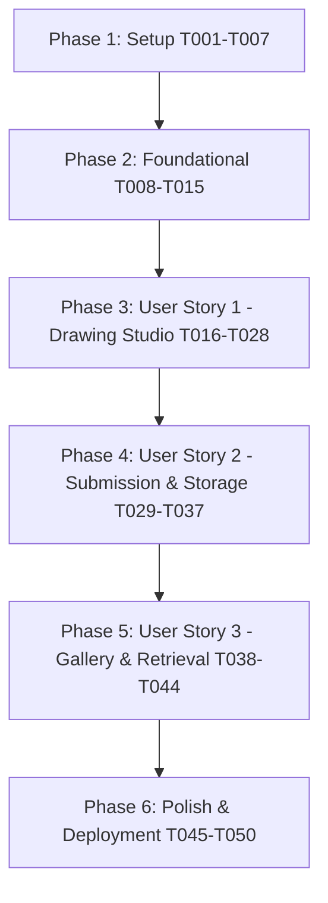

# Tasks: Drawing Canvas MVP

**Input**: Design documents from [`/specs/001-drawing-canvas-mvp/`](file:///C:/Users/musa/Desktop/throatgoat/specs/001-drawing-canvas-mvp/)  
**Prerequisites**: [`plan.md`](file:///C:/Users/musa/Desktop/throatgoat/specs/001-drawing-canvas-mvp/plan.md), [`spec.md`](file:///C:/Users/musa/Desktop/throatgoat/specs/001-drawing-canvas-mvp/spec.md), [`data-model.md`](file:///C:/Users/musa/Desktop/throatgoat/specs/001-drawing-canvas-mvp/data-model.md), [`research.md`](file:///C:/Users/musa/Desktop/throatgoat/specs/001-drawing-canvas-mvp/research.md), [`contracts/`](file:///C:/Users/musa/Desktop/throatgoat/specs/001-drawing-canvas-mvp/contracts/), [`quickstart.md`](file:///C:/Users/musa/Desktop/throatgoat/specs/001-drawing-canvas-mvp/quickstart.md)

---

## Format: `- [ ] [ID] [P?] [Story?] Description with file path`

- **[P]**: Parallelizable task (different file, no blocking dependencies).
- **[Story]**: User story identifier (`[US1]`, `[US2]`, `[US3]`) mapping directly to priorities from `spec.md`.

---

## Phase 1: Setup (Shared Infrastructure)

**Purpose**: Initialize project repository, install core libraries, and configure environment tools.

- [X] T001 Initialize Next.js 15 App Router project with TypeScript and Tailwind CSS in `package.json`
- [X] T002 Install core dependencies (`konva`, `react-konva`, `zod`, `@supabase/supabase-js`, `lucide-react`, `clsx`, `tailwind-merge`, `canvas-confetti`) in `package.json`
- [X] T003 [P] Install development & testing dependencies (`vitest`, `@testing-library/react`, `@playwright/test`, `jsdom`) in `package.json`
- [X] T004 [P] Configure TypeScript compiler settings and path aliases (`@/*`) in `tsconfig.json`
- [X] T005 [P] Configure environment variable templates in `.env.example` and `.env.local`
- [X] T006 [P] Configure ESLint and Prettier formatting rules in `.eslintrc.json` and `.prettierrc`
- [X] T007 [P] Configure Vitest test runner configuration in `vitest.config.ts`

---

## Phase 2: Foundational (Blocking Prerequisites)

**Purpose**: Core data models, Supabase database schema, storage abstraction, and shared TypeScript contracts that MUST be complete before ANY user story can proceed.

**⚠️ CRITICAL**: No user story work can begin until this phase is complete.

- [X] T008 Define shared TypeScript interfaces for canvas state, tools, and strokes in `src/types/canvas.ts`
- [X] T009 [P] Define shared TypeScript interfaces for drawing entities and DTOs in `src/types/drawing.ts`
- [X] T010 [P] Define shared API response and error contract types in `src/types/api.ts`
- [X] T011 Create PostgreSQL migration script for `drawings` table with indexes and constraints in `supabase/migrations/20260823000000_create_drawings.sql`
- [X] T012 Define pluggable `IStorageProvider` TypeScript interface contract in `src/lib/storage/adapter.ts`
- [X] T013 Implement Supabase client instances (browser client and server admin client) in `src/lib/db/supabase.ts`
- [X] T014 Implement `SupabaseStorageProvider` adhering to `IStorageProvider` in `src/lib/storage/supabase-storage.ts`
- [X] T015 [P] Implement Zod runtime validation schemas for submissions and queries in `src/lib/validation/drawing-schemas.ts`

**Checkpoint**: Foundation ready - Core types, database migration, storage adapter, and validation schemas are established.

---

## Phase 3: User Story 1 - Interactive Browser Drawing Canvas (Priority: P1) 🎯 MVP

**Goal**: Deliver a responsive, in-browser drawing studio featuring a centered canvas, continuous 60fps mouse and touch drawing, brush size/color customization, eraser tool, undo stack, and confirmation-safeguarded canvas clear.

**Independent Test**: Open the application, draw smooth lines with mouse and touch input, change colors/brush sizes, erase strokes, undo actions, and clear the canvas with confirmation without any console errors.

### Tests for User Story 1

- [X] T016 [P] [US1] Unit test for stroke history management and undo operations in `tests/unit/canvas-history.test.ts`
- [X] T017 [P] [US1] Unit test for touch and pointer coordinate normalization in `tests/unit/pointer-utils.test.ts`

### Implementation for User Story 1

- [X] T018 [US1] Create drawing state hook `useDrawingState` managing strokes, undo history, active tool, color, and brush size in `src/hooks/useDrawingState.ts`
- [X] T019 [US1] Implement Konva stage component `KonvaStage` with Bézier stroke smoothing (`tension: 0.5`), eraser composite mode, and touch/pointer event listeners in `src/components/canvas/KonvaStage.tsx`
- [X] T020 [US1] Implement dynamic client-side SSR wrapper `DrawingCanvas` using `next/dynamic` in `src/components/canvas/DrawingCanvas.tsx`
- [X] T021 [P] [US1] Implement color palette component `ColorPalette` with 8+ curated colors in `src/components/canvas/ColorPalette.tsx`
- [X] T022 [P] [US1] Implement brush size selector component `SizeSelector` with presets and slider in `src/components/canvas/SizeSelector.tsx`
- [X] T023 [P] [US1] Implement clear canvas confirmation dialog `ClearModal` in `src/components/canvas/ClearModal.tsx`
- [X] T024 [US1] Implement drawing toolbar component `Toolbar` integrating color palette, size selector, eraser toggle, undo, clear, and submit triggers in `src/components/canvas/Toolbar.tsx`
- [X] T025 [P] [US1] Implement application header with "Throat Goat" branding and navigation in `src/components/branding/Header.tsx`
- [X] T026 [P] [US1] Implement humorous application footer in `src/components/branding/Footer.tsx`
- [X] T027 [US1] Implement root layout with styling, fonts, and metadata in `src/app/layout.tsx` and `src/app/globals.css`
- [X] T028 [US1] Assemble main drawing studio page with centered canvas and toolbar in `src/app/page.tsx`

**Checkpoint**: User Story 1 is fully functional and testable independently. Users can draw, style, erase, undo, and clear directly in the browser.

---

## Phase 4: User Story 2 - Artwork Submission & Persistent Storage (Priority: P2)

**Goal**: Export canvas drawings to opaque solid white WebP/PNG images, execute zero-trust server validation, persist image binary in Supabase Storage and metadata in PostgreSQL, and display interactive success confirmation.

**Independent Test**: Draw on the canvas, click Submit, observe loading state, verify success modal with celebration confetti, confirm file in storage bucket, and verify metadata row in PostgreSQL database while preserving canvas on network failure.

### Tests for User Story 2

- [X] T029 [P] [US2] Unit test for solid white background export and MIME conversion in `tests/unit/export-utils.test.ts`
- [X] T030 [P] [US2] Unit test for Zod submission payload validation in `tests/unit/validation.test.ts`
- [X] T031 [P] [US2] Integration test for `POST /api/drawings` route handler in `tests/integration/drawing-api.test.ts`

### Implementation for User Story 2

- [X] T032 [US2] Implement canvas export utility `exportCanvasToBlob` ensuring solid white background composite in `src/lib/canvas/export-utils.ts`
- [X] T033 [US2] Implement server-side submission Route Handler `POST /api/drawings` with Zod validation, buffer conversion, storage upload, and database insert in `src/app/api/drawings/route.ts`
- [X] T034 [US2] Create submission orchestration hook `useSubmitDrawing` with loading state, debouncing, and error handling in `src/hooks/useSubmitDrawing.ts`
- [X] T035 [US2] Implement submit button with loading spinner and disabled states in `src/components/submission/SubmitButton.tsx`
- [X] T036 [US2] Implement submission success modal `SuccessModal` with image preview, confetti trigger, and "Draw Another" / "View Gallery" buttons in `src/components/submission/SuccessModal.tsx`
- [X] T037 [US2] Integrate submission flow and success modal into main drawing page `src/app/page.tsx`

**Checkpoint**: User Stories 1 AND 2 work seamlessly. Artwork is exported, validated, stored in cloud persistence, and confirmed with feedback.

---

## Phase 5: User Story 3 - Gallery & Drawing Retrieval (Priority: P3)

**Goal**: Provide a public gallery feed that retrieves and displays submitted drawings chronologically with previews, timestamps, enlarged modal viewing, and graceful error fallbacks.

**Independent Test**: Open `/gallery`, verify previously submitted drawings render in descending chronological order, click a card to open the enlarged modal, refresh the page to confirm persistence across sessions, and verify placeholder fallback for missing images.

### Tests for User Story 3

- [X] T038 [P] [US3] Integration test for `GET /api/drawings` and `GET /api/drawings/[id]` route handlers in `tests/integration/gallery-api.test.ts`

### Implementation for User Story 3

- [X] T039 [US3] Implement drawing list retrieval Route Handler `GET /api/drawings` with pagination and sorting in `src/app/api/drawings/route.ts`
- [X] T040 [US3] Implement single drawing retrieval Route Handler `GET /api/drawings/[id]` in `src/app/api/drawings/[id]/route.ts`
- [X] T041 [P] [US3] Implement gallery card component `DrawingCard` with thumbnail, creation date, stroke count, and broken-image fallback in `src/components/gallery/DrawingCard.tsx`
- [X] T042 [P] [US3] Implement enlarged preview dialog `DrawingModal` in `src/components/gallery/DrawingModal.tsx`
- [X] T043 [US3] Implement responsive drawing grid component `DrawingGrid` with empty state in `src/components/gallery/DrawingGrid.tsx`
- [X] T044 [US3] Implement public gallery page with data fetching and header navigation in `src/app/gallery/page.tsx`

**Checkpoint**: All three user stories are complete and integrated. Users can draw, submit, and browse community artwork persistently.

---

## Phase 6: Polish, Quality Gates & Production Deployment

**Purpose**: Cross-cutting improvements, responsive mobile refinement, automated E2E tests, production build verification, and deployment.

- [X] T045 [P] Implement responsive canvas resize and touch-gesture prevention on mobile viewports in `src/components/canvas/DrawingCanvas.tsx`
- [X] T046 [P] Add meme-themed visual polish, sound cues/flairs, and animated button interactions in `src/app/globals.css`
- [X] T047 Implement Playwright end-to-end user journey test (drawing -> submission -> gallery verification) in `tests/e2e/drawing-flow.spec.ts`
- [X] T048 [P] Create production deployment guide and environment configuration checklist in `docs/deployment.md`
- [X] T049 Verify Next.js production build and TypeScript compilation with `npm run build`
- [X] T050 Deploy application to production environment (e.g. Vercel) and verify end-to-end drawing and gallery persistence

---

## Dependencies & Execution Order



### Phase Dependencies
- **Phase 1 (Setup)**: Can start immediately (T001-T007).
- **Phase 2 (Foundational)**: Depends on Phase 1 completion; blocks all user stories (T008-T015).
- **Phase 3 (User Story 1 - P1)**: Depends on Phase 2; delivers standalone drawing MVP (T016-T028).
- **Phase 4 (User Story 2 - P2)**: Depends on Phase 3; delivers end-to-end persistence (T029-T037).
- **Phase 5 (User Story 3 - P3)**: Depends on Phase 4; delivers public community gallery (T038-T044).
- **Phase 6 (Polish & Deployment)**: Depends on all user stories being functional (T045-T050).

---

## Parallel Execution Opportunities

### User Story 1 (Phase 3)
```bash
# Run tests first:
Task: T016 [US1] Unit test for stroke history management in tests/unit/canvas-history.test.ts
Task: T017 [US1] Unit test for touch/pointer normalization in tests/unit/pointer-utils.test.ts

# Implement independent UI components in parallel:
Task: T021 [US1] Color palette component in src/components/canvas/ColorPalette.tsx
Task: T022 [US1] Brush size selector in src/components/canvas/SizeSelector.tsx
Task: T023 [US1] Clear canvas modal in src/components/canvas/ClearModal.tsx
Task: T025 [US1] Application header in src/components/branding/Header.tsx
Task: T026 [US1] Humorous footer in src/components/branding/Footer.tsx
```

### User Story 2 (Phase 4)
```bash
# Run tests first:
Task: T029 [US2] Unit test for export in tests/unit/export-utils.test.ts
Task: T030 [US2] Unit test for validation in tests/unit/validation.test.ts
Task: T031 [US2] Integration test for API in tests/integration/drawing-api.test.ts

# Implement UI components in parallel:
Task: T035 [US2] Submit button in src/components/submission/SubmitButton.tsx
Task: T036 [US2] Success modal in src/components/submission/SuccessModal.tsx
```

---

## Future Phase: Multiplayer Extension Points (Advisory)

These architectural insertion points will enable multiplayer features in subsequent phases without modifying core drawing canvas components:

1. **Room & Lobby Coordination**: Add `src/lib/multiplayer/room-manager.ts` and `src/app/room/[code]/page.tsx` to handle game matchmaking, player lists, and host controls.
2. **Real-Time Stroke Broadcasts**: Extend `src/hooks/useDrawingState.ts` with a broadcast callback that streams serialized `DrawingStroke` payloads over WebSockets / Supabase Realtime channels.
3. **Turn Rotations & Prompts**: Add `src/lib/multiplayer/game-engine.ts` to manage round sequences (Draw Prompt -> Pass Drawing -> Guess Drawing -> Reveal Chain).
4. **Synchronized Round Timers**: Connect server-authoritative timer events to a timer overlay component in `src/components/canvas/RoundTimer.tsx`.
