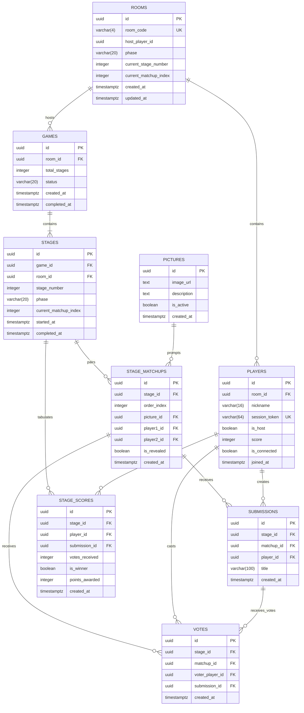

# Data Model & Schema Specification: Multiplayer Party Game MVP (1v1 Matchups)

**Feature**: `002-multiplayer-game-mvp`
**Date**: 2026-08-25

## 1. Relational Entities & Attributes



---

## 2. PostgreSQL DDL Schema

```sql
CREATE EXTENSION IF NOT EXISTS "uuid-ossp";

-- 1. Pictures Catalog
CREATE TABLE pictures (
    id UUID PRIMARY KEY DEFAULT uuid_generate_v4(),
    image_url TEXT NOT NULL,
    description TEXT,
    is_active BOOLEAN NOT NULL DEFAULT TRUE,
    created_at TIMESTAMPTZ NOT NULL DEFAULT NOW()
);

-- 2. Rooms
CREATE TABLE rooms (
    id UUID PRIMARY KEY DEFAULT uuid_generate_v4(),
    room_code VARCHAR(4) NOT NULL UNIQUE,
    host_player_id UUID,
    phase VARCHAR(20) NOT NULL DEFAULT 'LOBBY' CHECK (phase IN ('LOBBY', 'SUBMITTING', 'VOTING', 'RESULTS', 'FINISHED')),
    current_stage_number INTEGER NOT NULL DEFAULT 1,
    current_matchup_index INTEGER NOT NULL DEFAULT 0,
    created_at TIMESTAMPTZ NOT NULL DEFAULT NOW(),
    updated_at TIMESTAMPTZ NOT NULL DEFAULT NOW()
);

-- 3. Players
CREATE TABLE players (
    id UUID PRIMARY KEY DEFAULT uuid_generate_v4(),
    room_id UUID NOT NULL REFERENCES rooms(id) ON DELETE CASCADE,
    nickname VARCHAR(16) NOT NULL,
    session_token VARCHAR(64) NOT NULL UNIQUE,
    is_host BOOLEAN NOT NULL DEFAULT FALSE,
    score INTEGER NOT NULL DEFAULT 0,
    is_connected BOOLEAN NOT NULL DEFAULT TRUE,
    joined_at TIMESTAMPTZ NOT NULL DEFAULT NOW()
);

-- 4. Stages & 1v1 Matchups
CREATE TABLE stages (
    id UUID PRIMARY KEY DEFAULT uuid_generate_v4(),
    game_id UUID NOT NULL REFERENCES games(id) ON DELETE CASCADE,
    room_id UUID NOT NULL REFERENCES rooms(id) ON DELETE CASCADE,
    stage_number INTEGER NOT NULL CHECK (stage_number IN (1, 2)),
    phase VARCHAR(20) NOT NULL DEFAULT 'SUBMITTING' CHECK (phase IN ('SUBMITTING', 'VOTING', 'RESULTS')),
    current_matchup_index INTEGER NOT NULL DEFAULT 0,
    started_at TIMESTAMPTZ NOT NULL DEFAULT NOW(),
    completed_at TIMESTAMPTZ,
    CONSTRAINT uq_game_stage_number UNIQUE (game_id, stage_number)
);

CREATE TABLE stage_matchups (
    id UUID PRIMARY KEY DEFAULT uuid_generate_v4(),
    stage_id UUID NOT NULL REFERENCES stages(id) ON DELETE CASCADE,
    order_index INTEGER NOT NULL DEFAULT 0,
    picture_id UUID NOT NULL REFERENCES pictures(id),
    player1_id UUID NOT NULL REFERENCES players(id) ON DELETE CASCADE,
    player2_id UUID NOT NULL REFERENCES players(id) ON DELETE CASCADE,
    is_revealed BOOLEAN NOT NULL DEFAULT FALSE,
    created_at TIMESTAMPTZ NOT NULL DEFAULT NOW(),
    CONSTRAINT uq_stage_matchup_order UNIQUE (stage_id, order_index)
);

-- 5. Submissions & Votes
CREATE TABLE submissions (
    id UUID PRIMARY KEY DEFAULT uuid_generate_v4(),
    stage_id UUID NOT NULL REFERENCES stages(id) ON DELETE CASCADE,
    matchup_id UUID REFERENCES stage_matchups(id) ON DELETE CASCADE,
    player_id UUID NOT NULL REFERENCES players(id) ON DELETE CASCADE,
    title VARCHAR(100) NOT NULL,
    created_at TIMESTAMPTZ NOT NULL DEFAULT NOW()
);

CREATE TABLE votes (
    id UUID PRIMARY KEY DEFAULT uuid_generate_v4(),
    stage_id UUID NOT NULL REFERENCES stages(id) ON DELETE CASCADE,
    matchup_id UUID REFERENCES stage_matchups(id) ON DELETE CASCADE,
    voter_player_id UUID NOT NULL REFERENCES players(id) ON DELETE CASCADE,
    submission_id UUID NOT NULL REFERENCES submissions(id) ON DELETE CASCADE,
    created_at TIMESTAMPTZ NOT NULL DEFAULT NOW()
);
```
