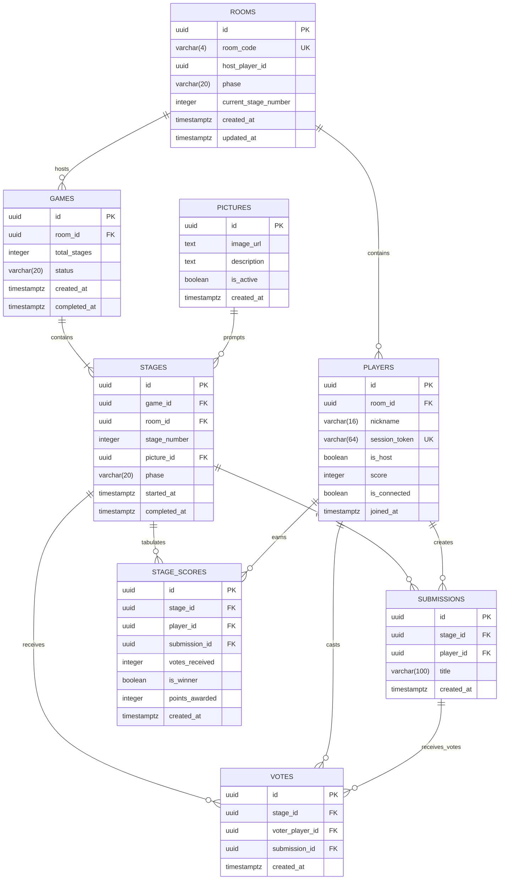

# Data Model & Schema Specification: Multiplayer Party Game MVP

**Feature**: `002-multiplayer-game-mvp`
**Date**: 2026-08-23

## 1. Relational Entities & Attributes



---

## 2. PostgreSQL DDL Schema

```sql
-- Enable UUID extension
CREATE EXTENSION IF NOT EXISTS "uuid-ossp";

-- 1. Pictures Catalog
CREATE TABLE pictures (
    id UUID PRIMARY KEY DEFAULT uuid_generate_v4(),
    image_url TEXT NOT NULL,
    description TEXT,
    is_active BOOLEAN NOT NULL DEFAULT TRUE,
    created_at TIMESTAMPTZ NOT NULL DEFAULT NOW()
);

-- 2. Rooms
CREATE TABLE rooms (
    id UUID PRIMARY KEY DEFAULT uuid_generate_v4(),
    room_code VARCHAR(4) NOT NULL UNIQUE,
    host_player_id UUID,
    phase VARCHAR(20) NOT NULL DEFAULT 'LOBBY' CHECK (phase IN ('LOBBY', 'SUBMITTING', 'VOTING', 'RESULTS', 'FINISHED')),
    current_stage_number INTEGER NOT NULL DEFAULT 1,
    created_at TIMESTAMPTZ NOT NULL DEFAULT NOW(),
    updated_at TIMESTAMPTZ NOT NULL DEFAULT NOW()
);

-- 3. Players
CREATE TABLE players (
    id UUID PRIMARY KEY DEFAULT uuid_generate_v4(),
    room_id UUID NOT NULL REFERENCES rooms(id) ON DELETE CASCADE,
    nickname VARCHAR(16) NOT NULL,
    session_token VARCHAR(64) NOT NULL UNIQUE,
    is_host BOOLEAN NOT NULL DEFAULT FALSE,
    score INTEGER NOT NULL DEFAULT 0,
    is_connected BOOLEAN NOT NULL DEFAULT TRUE,
    joined_at TIMESTAMPTZ NOT NULL DEFAULT NOW()
);

-- Add foreign key back to rooms for host_player_id
ALTER TABLE rooms
ADD CONSTRAINT fk_rooms_host_player
FOREIGN KEY (host_player_id) REFERENCES players(id) ON DELETE SET NULL;

-- 4. Games
CREATE TABLE games (
    id UUID PRIMARY KEY DEFAULT uuid_generate_v4(),
    room_id UUID NOT NULL REFERENCES rooms(id) ON DELETE CASCADE,
    total_stages INTEGER NOT NULL DEFAULT 2,
    status VARCHAR(20) NOT NULL DEFAULT 'IN_PROGRESS' CHECK (status IN ('IN_PROGRESS', 'COMPLETED')),
    created_at TIMESTAMPTZ NOT NULL DEFAULT NOW(),
    completed_at TIMESTAMPTZ
);

-- 5. Stages
CREATE TABLE stages (
    id UUID PRIMARY KEY DEFAULT uuid_generate_v4(),
    game_id UUID NOT NULL REFERENCES games(id) ON DELETE CASCADE,
    room_id UUID NOT NULL REFERENCES rooms(id) ON DELETE CASCADE,
    stage_number INTEGER NOT NULL CHECK (stage_number IN (1, 2)),
    picture_id UUID NOT NULL REFERENCES pictures(id),
    phase VARCHAR(20) NOT NULL DEFAULT 'SUBMITTING' CHECK (phase IN ('SUBMITTING', 'VOTING', 'RESULTS')),
    started_at TIMESTAMPTZ NOT NULL DEFAULT NOW(),
    completed_at TIMESTAMPTZ,
    CONSTRAINT uq_game_stage_number UNIQUE (game_id, stage_number)
);

-- 6. Submissions
CREATE TABLE submissions (
    id UUID PRIMARY KEY DEFAULT uuid_generate_v4(),
    stage_id UUID NOT NULL REFERENCES stages(id) ON DELETE CASCADE,
    player_id UUID NOT NULL REFERENCES players(id) ON DELETE CASCADE,
    title VARCHAR(100) NOT NULL,
    created_at TIMESTAMPTZ NOT NULL DEFAULT NOW(),
    CONSTRAINT uq_stage_player_submission UNIQUE (stage_id, player_id)
);

-- 7. Votes
CREATE TABLE votes (
    id UUID PRIMARY KEY DEFAULT uuid_generate_v4(),
    stage_id UUID NOT NULL REFERENCES stages(id) ON DELETE CASCADE,
    voter_player_id UUID NOT NULL REFERENCES players(id) ON DELETE CASCADE,
    submission_id UUID NOT NULL REFERENCES submissions(id) ON DELETE CASCADE,
    created_at TIMESTAMPTZ NOT NULL DEFAULT NOW(),
    CONSTRAINT uq_stage_voter_vote UNIQUE (stage_id, voter_player_id)
);

-- 8. Stage Scores
CREATE TABLE stage_scores (
    id UUID PRIMARY KEY DEFAULT uuid_generate_v4(),
    stage_id UUID NOT NULL REFERENCES stages(id) ON DELETE CASCADE,
    player_id UUID NOT NULL REFERENCES players(id) ON DELETE CASCADE,
    submission_id UUID NOT NULL REFERENCES submissions(id) ON DELETE CASCADE,
    votes_received INTEGER NOT NULL DEFAULT 0,
    is_winner BOOLEAN NOT NULL DEFAULT FALSE,
    points_awarded INTEGER NOT NULL DEFAULT 0,
    created_at TIMESTAMPTZ NOT NULL DEFAULT NOW(),
    CONSTRAINT uq_stage_player_score UNIQUE (stage_id, player_id)
);

-- Indexes for Fast Realtime & Query Performance
CREATE INDEX idx_players_room_id ON players(room_id);
CREATE INDEX idx_players_session_token ON players(session_token);
CREATE INDEX idx_stages_room_id ON stages(room_id);
CREATE INDEX idx_submissions_stage_id ON submissions(stage_id);
CREATE INDEX idx_votes_stage_id ON votes(stage_id);
CREATE INDEX idx_votes_submission_id ON votes(submission_id);
CREATE INDEX idx_stage_scores_stage_id ON stage_scores(stage_id);
```

---

## 3. Finite State Machine Transitions

| Current Phase | Trigger Event | Condition | Next Phase | Server Side Actions |
|:---|:---|:---|:---|:---|
| `LOBBY` | `startGame` | Called by Host AND `active_players >= 3` | `SUBMITTING` (Stage 1) | Creates `games`, selects 2 distinct `pictures`, creates Stage 1 with Picture #1, updates `rooms.phase='SUBMITTING'`, broadcasts `room_phase_changed`. |
| `SUBMITTING` (Stage 1) | `submitTitle` | All active connected players have submitted | `VOTING` (Stage 1) | Updates `stages.phase='VOTING'`, `rooms.phase='VOTING'`, broadcasts `voting_started` with sanitized voting list. |
| `VOTING` (Stage 1) | `submitVote` | All active connected players have voted | `RESULTS` (Stage 1) | Executes `resolveStage(stage_1_id)`: tallies votes, assigns 100 pts/vote + 250 bonus to top vote getter(s), updates player cumulative scores, sets `rooms.phase='RESULTS'`, broadcasts `results_revealed`. |
| `RESULTS` (Stage 1) | `advanceStage` | Host clicks continue OR 10s timeout | `SUBMITTING` (Stage 2) | Creates Stage 2 with Picture #2, updates `rooms.current_stage_number=2`, `rooms.phase='SUBMITTING'`, broadcasts `room_phase_changed`. |
| `SUBMITTING` (Stage 2) | `submitTitle` | All active connected players have submitted | `VOTING` (Stage 2) | Updates `stages.phase='VOTING'`, `rooms.phase='VOTING'`, broadcasts `voting_started`. |
| `VOTING` (Stage 2) | `submitVote` | All active connected players have voted | `RESULTS` (Stage 2) | Executes `resolveStage(stage_2_id)`: tallies votes, awards points, broadcasts `results_revealed`. |
| `RESULTS` (Stage 2) | `advanceStage` | Host clicks continue OR 10s timeout | `FINISHED` | Marks `games.status='COMPLETED'`, updates `rooms.phase='FINISHED'`, computes final leaderboard ranking, broadcasts `game_finished`. |
| `FINISHED` | `resetGame` | Called by Host | `LOBBY` | Resets `players.score = 0`, `rooms.current_stage_number = 1`, `rooms.phase = 'LOBBY'`, broadcasts `room_phase_changed`. |

---

## 4. Integrity Invariants & Validation Rules

1. **Self-Voting Prohibition**:
   - `SELECT player_id FROM submissions WHERE id = $submission_id` MUST NOT equal `$voter_player_id`.
   - Rejection code: `400 Bad Request` with `{ code: "SELF_VOTING_PROHIBITED", message: "You cannot vote for your own title." }`.
2. **Phase Gating**:
   - Submissions are rejected if `rooms.phase != 'SUBMITTING'`.
   - Votes are rejected if `rooms.phase != 'VOTING'`.
   - Game start is rejected if `rooms.phase != 'LOBBY'` or caller is not host.
3. **Uniqueness**:
   - Database constraint `uq_stage_player_submission` stops concurrent duplicate submissions.
   - Database constraint `uq_stage_voter_vote` stops concurrent duplicate votes.
4. **Room Boundaries**:
   - Submissions and votes must belong strictly to the stage associated with the player's active room.
