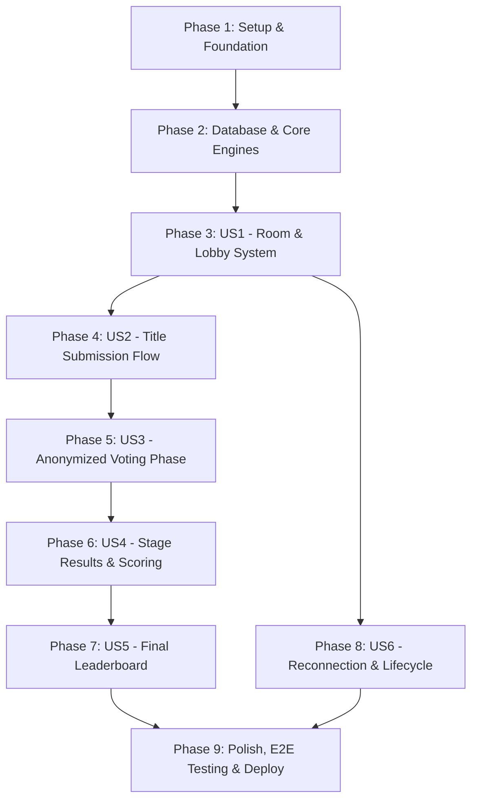

# Tasks: Multiplayer Party Game MVP

**Input**: Design documents from `specs/002-multiplayer-game-mvp/`
- [spec.md](./spec.md) (User stories, priorities, functional requirements)
- [plan.md](./plan.md) (Architecture, tech stack, directory structure)
- [data-model.md](./data-model.md) (Database schema, state machine, constraints)
- [game-api.yaml](./contracts/game-api.yaml) (OpenAPI endpoint contracts)
- [research.md](./research.md) (Technical decisions & trade-offs)
- [quickstart.md](./quickstart.md) (Testing & multiplayer walkthrough)

**Prerequisites**: All Phase 0 research and Phase 1 design artifacts approved; Constitution v2.0.0 ratified.

**Organization**: Tasks are structured in strict dependency order and grouped by phase and user story to enable incremental, testable delivery.

## Format: `[ID] [P?] [Story?] Description with file path`

- **[P]**: Parallelizable (independent file, no blocking dependencies on incomplete tasks)
- **[Story]**: User story identifier (`[US1]` through `[US6]`) mapping directly to `spec.md`

---

## Phase 1: Setup & Project Foundation

**Purpose**: Initialize runtime framework, configuration, dependencies, shared types, and client/server abstractions.

- [x] T001 Initialize Next.js 15 App Router configuration and directory tree in `src/` and `next.config.ts`
- [x] T002 [P] Configure TypeScript `strict: true` and ESLint/Prettier rules in `tsconfig.json` and `.eslintrc.json`
- [x] T003 [P] Configure Tailwind CSS with humorous theme palette and responsive breakpoints in `tailwind.config.ts` and `src/app/globals.css`
- [x] T004 [P] Install and verify dependencies (`@supabase/supabase-js`, `zod`, `lucide-react`, `canvas-confetti`, `clsx`, `tailwind-merge`) in `package.json`
- [x] T005 [P] Create environment variable loader and schema validator in `src/lib/env.ts` and `.env.example`
- [x] T006 [P] Create browser and server-side Supabase client utilities in `src/lib/supabase/client.ts` and `src/lib/supabase/server.ts`
- [x] T007 [P] Define centralized TypeScript domain types and interfaces in `src/types/game.ts`
- [x] T008 [P] Define runtime Zod validation schemas for all inputs and API payloads in `src/lib/validators/game-schemas.ts`

**Checkpoint**: Foundation initialized, types and validation contracts available across the application.

---

## Phase 2: Foundational (Database Schema, Game Engines & Realtime)

**Purpose**: Core database tables, constraints, game state engines, scoring algorithms, and realtime event channels that MUST be complete before user stories can execute.

**⚠️ CRITICAL**: Blocks all user stories.

- [x] T009 Write PostgreSQL migration creating tables `pictures`, `rooms`, `players`, `games`, `stages`, `submissions`, `votes`, `stage_scores` with PKs, FKs, indexes, and unique constraints in `supabase/migrations/20260823000000_multiplayer_schema.sql`
- [x] T010 [P] Create curated tattoo pictures seed dataset (with image URLs, descriptions, and active status) in `supabase/seed.sql`
- [x] T011 [P] Implement 4-character unguessable uppercase room code generator with collision retry logic in `src/lib/game/room-code.ts`
- [x] T012 [P] Implement pure deterministic finite state machine transition and phase validation engine in `src/lib/game/state-machine.ts`
- [x] T013 [P] Implement pure score calculation, vote tallying, and tie-breaking algorithms in `src/lib/game/scoring.ts`
- [x] T014 [P] Implement typed Supabase Realtime channel subscription and event broadcast manager in `src/lib/supabase/realtime.ts`
- [x] T015 [P] Create shared UI presentation components (`GameHeader`, `ImageCard`, `ToastError`, `LoadingSpinner`) in `src/components/shared/`

**Checkpoint**: Database schema and pure game engines in place. Ready to implement user stories in priority order.

---

## Phase 3: User Story 1 - Room Hosting, Joining & Lobby Coordination (Priority: P1) 🎯 MVP Core

**Goal**: Enable users to create a room as host, join via 4-character room code with a nickname, view real-time player lobby roster, and have the host initiate the game when $\ge 3$ players join.

**Independent Test**: Create room in Browser 1, join with room code in Browsers 2 & 3, verify live lobby updates across all 3 browsers, and verify host-only start game triggers Stage 1.

### Tests for User Story 1
- [x] T016 [P] [US1] Unit test room code generation and state machine lobby transitions in `tests/unit/room-code.test.ts`
- [x] T017 [P] [US1] Integration test for room creation, joining, capacity limits (3–8), and host start validation in `tests/integration/room-lifecycle.test.ts`

### Implementation for User Story 1
- [x] T018 [US1] Implement POST `/api/rooms` (createRoom) endpoint in `src/app/api/rooms/route.ts`
- [x] T019 [US1] Implement POST `/api/rooms/[code]/join` (joinRoom) endpoint with capacity check in `src/app/api/rooms/[code]/join/route.ts`
- [x] T020 [US1] Implement POST `/api/rooms/[code]/start` (startGame) endpoint validating host role and minimum 3 players in `src/app/api/rooms/[code]/start/route.ts`
- [x] T021 [US1] Build landing page with Host Game modal and Join Game form in `src/app/page.tsx`
- [x] T022 [US1] Build Lobby component with room code display, copy link, player list, and host start control in `src/components/lobby/LobbyView.tsx` and `src/components/lobby/PlayerList.tsx`
- [x] T023 [US1] Assemble main game room controller page with Realtime lobby subscriptions in `src/app/room/[code]/page.tsx`

**Checkpoint**: Users can host, join, assemble in the lobby, and start the game.

---

## Phase 4: User Story 2 - Stage 1 & Stage 2 Picture-Title Submission Flow (Priority: P1)

**Goal**: Present all active players with a curated tattoo picture and prompt task ("Give this tattoo your funniest title."), validate and store single submissions, lock input, and automatically transition room to `VOTING` when all players submit.

**Independent Test**: Transition room to Stage 1 `SUBMITTING`, display prompt picture to all players, submit titles from all 3 players, verify locked state, and verify automatic room transition to `VOTING`.

### Tests for User Story 2
- [x] T024 [P] [US2] Integration test for single submission constraint, title length validation (1–100 chars), and auto-transition to voting in `tests/integration/submission-flow.test.ts`

### Implementation for User Story 2
- [x] T025 [US2] Implement picture selection and stage assignment engine in `src/lib/game/pictures.ts`
- [x] T026 [US2] Implement POST `/api/rooms/[code]/submit` (submitTitle) endpoint enforcing phase guard and atomic submission threshold in `src/app/api/rooms/[code]/submit/route.ts`
- [x] T027 [US2] Build `SubmissionPhase` component with tattoo image display, prompt task, character-counter input, and submission lock status in `src/components/game/SubmissionPhase.tsx`
- [x] T028 [US2] Wire submission real-time events and auto-advance dispatcher in `src/app/room/[code]/page.tsx`

**Checkpoint**: Players receive curated tattoo pictures and submit titles with server-side validation and phase progression.

---

## Phase 5: User Story 3 - Anonymized, Self-Excluding Voting Phase (Priority: P1)

**Goal**: Display all submitted titles anonymously and randomized while strictly omitting each player's own submission from their voting view, enforce single vote per player, block server-side self-voting, and advance to `RESULTS` when all votes are cast.

**Independent Test**: Transition room to `VOTING`, verify Player A does not see Player A's title, cast votes, verify server rejects any injected self-vote attempt, and verify automatic transition to `RESULTS`.

### Tests for User Story 3
- [x] T029 [P] [US3] Unit and integration tests for self-voting rejection, duplicate vote rejection, and vote completion triggers in `tests/integration/voting-fairness.test.ts`

### Implementation for User Story 3
- [x] T030 [US3] Implement anonymous voting option query and randomization helper with self-submission filter in `src/lib/game/voting.ts`
- [x] T031 [US3] Implement POST `/api/rooms/[code]/vote` (submitVote) endpoint enforcing self-vote prohibition and duplicate vote prevention in `src/app/api/rooms/[code]/vote/route.ts`
- [x] T032 [US3] Build `VotingPhase` component with prompt picture preview, randomized title choices, selection state, and vote submission lock in `src/components/game/VotingPhase.tsx`
- [x] T033 [US3] Wire voting real-time event listener and stage resolution trigger in `src/app/room/[code]/page.tsx`

**Checkpoint**: Fair, anonymized, self-excluded voting is fully operational and enforced server-side.

---

## Phase 6: User Story 4 - Stage Results, Vote Breakdown & Scoring (Priority: P1)

**Goal**: Calculate vote counts, award 100 pts/vote + 250 bonus pts to round winner(s), handle ties with shared bonuses, display vote breakdown with author reveals, and advance from Stage 1 to Stage 2 with a new picture.

**Independent Test**: Complete voting with known vote distributions (e.g., 2 votes vs 1 vote), verify winner highlights, verify score increments, and verify transition to Stage 2 with Picture #2.

### Tests for User Story 4
- [x] T034 [P] [US4] Unit tests for vote tallying, score awarding (100 pts/vote + 250 winner bonus), and tie-breaking in `tests/unit/scoring.test.ts`

### Implementation for User Story 4
- [x] T035 [US4] Implement atomic stage resolution engine `resolveStage` in `src/lib/game/stage-resolution.ts`
- [x] T036 [US4] Implement POST `/api/rooms/[code]/advance` (advanceStage) endpoint transitioning Stage 1 to Stage 2 or Stage 2 to `FINISHED` in `src/app/api/rooms/[code]/advance/route.ts`
- [x] T037 [US4] Build `ResultsPhase` component displaying winning title highlight, author reveals, vote counts, points earned, and continue countdown in `src/components/game/ResultsPhase.tsx`
- [x] T038 [US4] Wire Results real-time broadcasts and stage advancement handlers in `src/app/room/[code]/page.tsx`

**Checkpoint**: Stage 1 and Stage 2 results, scoring, tie handling, and stage progression work seamlessly.

---

## Phase 7: User Story 5 - Final Leaderboard & Game Completion (Priority: P1)

**Goal**: Conclude the 2-stage game, render the Final Leaderboard sorted by cumulative score descending, celebrate the champion with humorous Throat Goat victory fanfare, and allow the host to trigger a rematch ("Play Again") returning the room to `LOBBY`.

**Independent Test**: Conclude Stage 2, verify transition to `FINISHED`, verify leaderboard ranking order and winner highlight, click "Play Again" as host, and verify room resets to `LOBBY` with zeroed scores.

### Tests for User Story 5
- [x] T039 [P] [US5] Unit tests for leaderboard sorting, tie handling, and game reset state transitions in `tests/unit/leaderboard.test.ts`

### Implementation for User Story 5
- [x] T040 [US5] Implement POST `/api/rooms/[code]/reset` (resetGame) endpoint in `src/app/api/rooms/[code]/reset/route.ts`
- [x] T041 [US5] Build `FinalLeaderboard` component with podium, ranked player cards, celebration animations, and Play Again / Exit controls in `src/components/leaderboard/FinalLeaderboard.tsx`
- [x] T042 [US5] Integrate game completion and rematch state transitions in `src/app/room/[code]/page.tsx`

**Checkpoint**: Full 2-stage game loop completes with leaderboard crowning and rematch capabilities.

---

## Phase 8: User Story 6 - Room Lifecycle, Reconnection & Disconnect Resilience (Priority: P2)

**Goal**: Ensure players can refresh the browser or recover from brief network disconnects without losing their place, and adjust completion thresholds dynamically if players disconnect.

**Independent Test**: Refresh browser during `SUBMITTING` and `VOTING`, verify instant state recovery from session token, simulate player departure, and verify remaining players can advance.

### Tests for User Story 6
- [x] T043 [P] [US6] Integration tests for session token hydration, browser refresh recovery, and host departure in `tests/integration/reconnection.test.ts`

### Implementation for User Story 6
- [x] T044 [US6] Implement GET `/api/rooms/[code]/state` (getRoomState) endpoint returning full authoritative state for reconnecting players in `src/app/api/rooms/[code]/state/route.ts`
- [x] T045 [US6] Implement POST `/api/rooms/[code]/leave` (leaveRoom) endpoint handling player disconnect and host reassignment in `src/app/api/rooms/[code]/leave/route.ts`
- [x] T046 [US6] Implement client session storage manager and automatic state hydration hook in `src/lib/hooks/useRoomSession.ts`
- [x] T047 [US6] Implement presence tracking and dynamic completion threshold adjustments for active connected players in `src/lib/game/presence-thresholds.ts`

**Checkpoint**: Robust session recovery, reconnect resilience, and clean host departure handling.

---

## Phase 9: Polish, Cross-Cutting Concerns, Testing & Deployment

**Purpose**: End-to-end integration, error boundaries, responsive UX polish, E2E multiplayer automation, and deployment documentation.

- [x] T048 [P] Implement user-facing error toast system and global error boundaries in `src/components/shared/ToastError.tsx` and `src/app/error.tsx`
- [x] T049 [P] Polish responsive styling, meme visual theme, touch target sizing, and animations across mobile/tablet/desktop in `src/app/globals.css` and Tailwind theme
- [x] T050 [P] Write multi-player Playwright E2E test simulating 3 concurrent browser sessions through a complete 2-stage game in `tests/e2e/multiplayer-game.spec.ts`
- [x] T051 [P] Configure production environment deployment guide, Supabase migration scripts, and Vercel settings in `docs/deployment.md`
- [x] T052 Execute complete automated test suite and quickstart multiplayer verification (`npm run test && npm run test:e2e`)

---

## Dependencies & Execution Order



### Phase Dependencies

- **Phase 1 (Setup)**: Can start immediately with no dependencies.
- **Phase 2 (Foundational)**: Depends on Phase 1 completion; **BLOCKS** all user stories.
- **Phase 3 (US1 - Lobby)**: Depends on Phase 2. Delivers initial playable lobby.
- **Phase 4 (US2 - Submissions)**: Depends on Phase 3.
- **Phase 5 (US3 - Voting)**: Depends on Phase 4.
- **Phase 6 (US4 - Results)**: Depends on Phase 5.
- **Phase 7 (US5 - Leaderboard)**: Depends on Phase 6. Completes the 2-stage MVP game loop.
- **Phase 8 (US6 - Reconnection)**: Can run in parallel with Phases 4–7 once US1 is established.
- **Phase 9 (Polish & Deploy)**: Depends on all user stories being complete.

---

## Parallel Execution Opportunities

```bash
# Launch Foundational pure engine tasks together (Phase 2):
Task: "T010 [P] Create curated tattoo pictures seed dataset in supabase/seed.sql"
Task: "T011 [P] Implement room code generator in src/lib/game/room-code.ts"
Task: "T012 [P] Implement state machine engine in src/lib/game/state-machine.ts"
Task: "T013 [P] Implement scoring engine in src/lib/game/scoring.ts"
Task: "T014 [P] Implement Realtime manager in src/lib/supabase/realtime.ts"
Task: "T015 [P] Create shared UI components in src/components/shared/"

# Launch Story tests and models in parallel within each story phase:
Task: "T016 [P] [US1] Unit test room code generation in tests/unit/room-code.test.ts"
Task: "T017 [P] [US1] Integration test for room creation in tests/integration/room-lifecycle.test.ts"
```

---

## Implementation Strategy

### MVP Milestone (Phases 1–7)
1. Complete Setup & Foundational (Phases 1 & 2).
2. Complete US1 (Lobby) → test 3-browser connection.
3. Complete US2 (Submission) → test prompt picture title entry.
4. Complete US3 (Voting) → test fair self-excluding vote casting.
5. Complete US4 (Results) → test score tabulation and Stage 2 progression.
6. Complete US5 (Leaderboard) → test champion podium and rematch.
7. **STOP and VALIDATE**: Run complete 2-stage match locally.

### Hardening & Deployment Milestone (Phases 8 & 9)
1. Complete US6 (Reconnection & Presence resilience).
2. Run automated unit, integration, and Playwright multi-client E2E tests.
3. Deploy to Vercel + Supabase production.

---

## Future Extension Points

*(Documented for post-MVP architecture; strictly OUT OF SCOPE for current implementation)*

1. **User Authentication & Persistent Profiles**: Add Supabase Auth to track career match history, trophies, and user stats.
2. **Configurable Stage & Round Options**: Allow host to configure 3 to 5 stages per match and set timed prompt countdowns (e.g., 60s submission timer).
3. **User-Uploaded & Community Picture Packs**: Allow players to submit custom tattoo photo packs or vote on community decks.
4. **Player Avatars & Customization**: Integrate SVG / avatar generators for personalized lobby icons.
5. **Spectator Mode**: Support non-voting or audience-voting participants joining beyond the 8-player room capacity.
6. **In-Game Chat / Sound FX**: Audio reactions and quick-chat emote soundboards.
